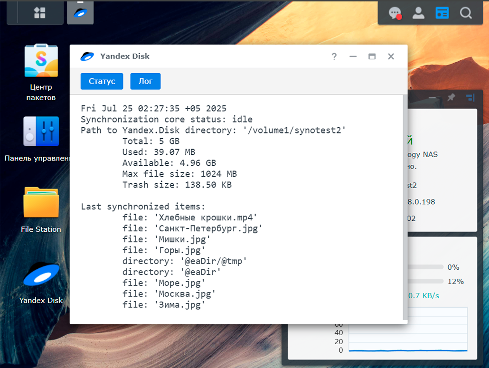
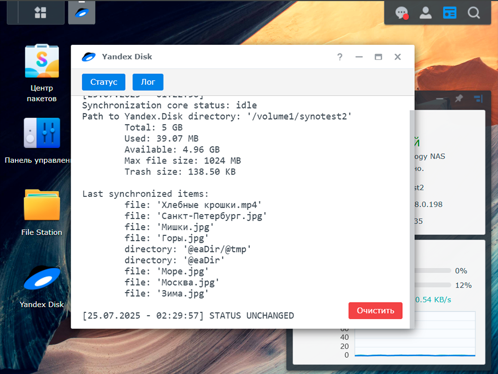

# Yandex Disk UI для Synology DSM

Интеграция официального [Консольного клиента Яндекс Диск для Linux](https://yandex.ru/support/yandex-360/customers/disk/desktop/linux/ru/) в Synology DSM.  
Авторизация и синхронизация выполняются через оригинальную утилиту `yandex-disk` адаптированную для использования в среде Synology DSM.  

### 🖼 Интерфейс
<p align="center">
  
  
</p>

### 🔧 Возможности
⚠️ ARM не поддерживается. Только  **x86_64** устройства.
- Простая установка как `.spk`-пакет
- Первоначальная настройка через SSH
- Графический интерфейс с возможностью:
   - Отображения статуса Yandex Disk
   - Логирования состояния
   - Очистки логов 

---

### ⚠️ ВНИМАТЕЛЬНО ОЗНАКОМЬТЕСЬ ПЕРЕД УСТАНОВКОЙ ПАКЕТА!

---

## 🔧 УСТАНОВКА
### [🎥 Видео-инструкция на Youtube](https://youtu.be/KB_YwQbxSW8)

1. При установке **отметьте чекбокс** `Запустить после установки`.

2. После установки **выдайте права на папку синхронизации**:
   - Перейдите в: `Панель управления → Папка общего доступа → [ваша папка] → Редактировать → Разрешения`
   - В разделе **Внутренний пользователь системы** найдите пользователя `sc-yandexdisk`
   - Выдайте права на **чтение и запись**

---

## 🖥 ПЕРВОНАЧАЛЬНАЯ НАСТРОЙКА

1. Подключитесь к NAS по **SSH**:
   - `Панель управления → Терминал и SNMP → Включить службу SSH`
   - Подключитесь по SSH

2. Найдите путь к папке для синхронизации, например:
   ```bash
   /volume1/yandexsync

3. Выполните команду:
   ```bash
   sudo -u sc-yandexdisk yandex-disk setup

4. Ответы на вопросы установщика:
   - Использовать прокси? Нет
   ```bash
   Would you like to use a proxy server? [y/N]: N
   ```
  
   - Авторизуйтесь в браузере, где выполнен вход в Яндекс.Диск 
   
   - Укажите путь к директории для синхронизации:
   ```bash
     Enter path to Yandex.Disk folder (Leave empty to use default folder '/var/packages/YandexDisk/home/Yandex.Disk'): /volume1/yandexsync
   ```
   
   - Не создавайте демон автозапуска:
   ```bash
     Would you like Yandex.Disk to launch on startup? [Y/n]: n
   ```

5. Завершение:
   ```bash
   Starting daemon process...Done
   ```

   - Обновите страницу DSM (F5)
   - Откройте приложение Yandex Disk в интерфейсе DSM
   - Проверьте статус и лог в приложении

---

#### 🙏 Проект вдохновлён инструкцией от Александра Linux: [Установка WireGuard на Synology NAS](https://bafista.ru/ustanovka-wireguard-na-synology-nas-v-dsm-7-i-dsm-6/)
